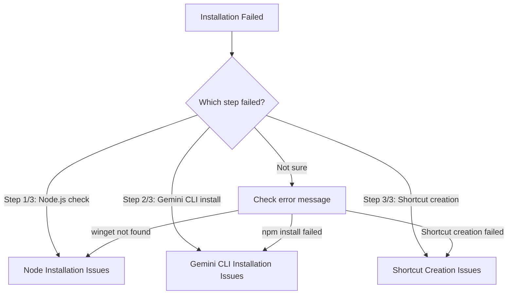

## Overview

This page provides an overview of the most common issues users encounter when installing Gemini CLI using the Easy Installer. Each issue links to a dedicated troubleshooting page with detailed solutions.

<AccordionGroup>
  <Accordion title="Node.js Installation Issues">
    The installer may fail to detect or install Node.js properly. This is one of the most common issues.
    
    **Common symptoms:**
    - `winget` command not found errors
    - Node.js installation completes but command is not recognized
    - Permission errors during Node.js installation
    
    <Info>
      See [Node.js Installation Troubleshooting](/troubleshooting/node-installation) for detailed solutions.
    </Info>
  </Accordion>

  <Accordion title="Gemini CLI Installation Failures">
    The npm installation of `@google/gemini-cli` may fail due to network issues, permissions, or cache problems.
    
    **Common symptoms:**
    - Network connection errors during npm install
    - Permission denied errors
    - Installation completes but `gemini` command not found
    
    <Info>
      See [Gemini CLI Installation Troubleshooting](/troubleshooting/gemini-cli-installation) for detailed solutions.
    </Info>
  </Accordion>

  <Accordion title="Shortcut Creation Issues">
    The desktop shortcut may fail to be created due to PowerShell execution policies or permission issues.
    
    **Common symptoms:**
    - Warning message: "Shortcut creation failed"
    - Shortcut created but doesn't launch Gemini CLI
    - PowerShell execution policy restrictions
    
    <Info>
      See [Shortcut Creation Troubleshooting](/troubleshooting/shortcut-creation) for detailed solutions.
    </Info>
  </Accordion>
</AccordionGroup>

## Quick Diagnosis

Use this flowchart to quickly identify which troubleshooting page you need:



## Error Message Reference

Here's a quick reference of error messages and their corresponding troubleshooting pages:

| Error Message | Issue Type | Troubleshooting Page |
|--------------|------------|---------------------|
| `[エラー] winget コマンドが見つかりません` | Node.js installation | [Node Installation](/troubleshooting/node-installation) |
| `Node.js のインストールが完了しました` (requires restart) | Node.js path configuration | [Node Installation](/troubleshooting/node-installation) |
| `[エラー] Gemini CLIのインストールに失敗しました` | Gemini CLI installation | [Gemini CLI Installation](/troubleshooting/gemini-cli-installation) |
| `[警告] ショートカットの作成に失敗しました` | Shortcut creation | [Shortcut Creation](/troubleshooting/shortcut-creation) |

## General Troubleshooting Tips

<Warning>
  Always run the installer as Administrator if you encounter permission errors.
</Warning>

### Run as Administrator

Many installation issues can be resolved by running the batch file with administrator privileges:

1. Right-click on `gemini-cli-easy-installer-20250706.bat`
2. Select "Run as administrator"
3. Click "Yes" on the User Account Control prompt

### Check System Requirements

Ensure your system meets the following requirements:

- **OS**: Windows 10 or Windows 11 (with latest updates)
- **winget**: App Installer from Microsoft Store (required for Node.js installation)
- **Internet**: Active internet connection for downloading packages
- **Permissions**: Administrator rights for installation

### Verify Internet Connection

Many issues stem from network connectivity problems:

```powershell
# Test internet connectivity
Test-Connection -ComputerName google.com -Count 2

# Test npm registry access
npm ping
```

## Getting Help

If none of the troubleshooting guides resolve your issue:

1. Check the [GitHub Issues](https://github.com/yourusername/gemini-cli-easy-installer/issues) for similar problems
2. Create a new issue with:
   - Complete error message
   - Windows version
   - Output of `node -v` and `npm -v` (if available)
   - Steps you've already tried

<Info>
  Before reporting an issue, please work through the relevant troubleshooting guide to gather diagnostic information.
</Info>